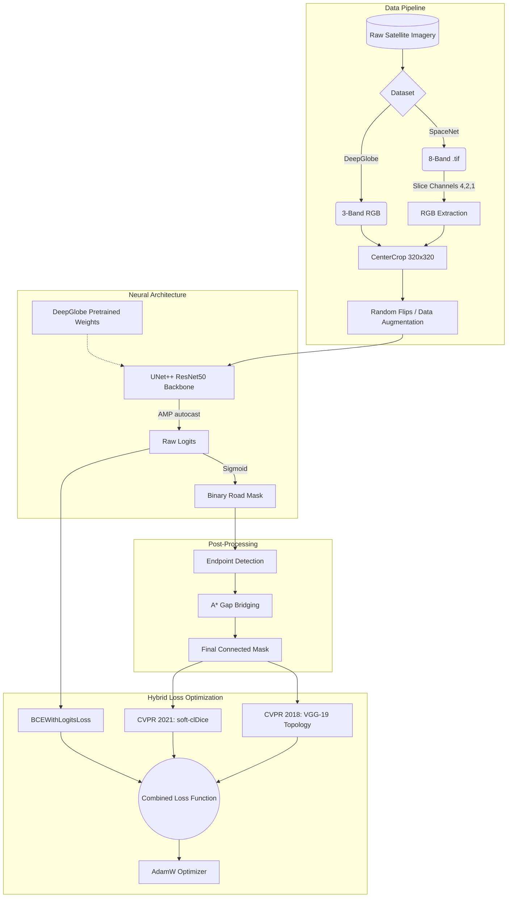

# Topology-Preserving Road Extraction (ISRO Hackathon)

This repository contains an end-to-end deep learning pipeline designed to extract complex road networks from high-resolution satellite imagery. It is built to natively support **SpaceNet 5** (Mumbai, Moscow) and **DeepGlobe** datasets.

## 🗺️ Project Flowchart



---

## 🧠 The Core Engine: `soft-clDice` Loss

Extracting tubular structures like roads or blood vessels is a uniquely difficult computer vision problem. Standard loss functions (like Cross-Entropy or standard Dice) are calculated pixel-by-pixel. If a model misses a single pixel that connects a 5-mile highway, standard Dice barely penalizes it because it's "just one pixel." However, in reality, the road network's **topology is fundamentally broken**.

To solve this, we implemented **`soft-clDice`** (Centerline Dice), introduced in the CVPR 2021 paper: *"clDice - A Novel Topology-Preserving Loss Function for Tubular Structure Segmentation"*.

### 1. Soft-Skeletonization (Algorithm 1)
To penalize broken roads, the model must understand the "centerline" or "skeleton" of the road network. However, traditional morphological skeletonization algorithms (like those in Scikit-Image) are non-differentiable—meaning a neural network cannot learn or backpropagate through them. 

Our pipeline implements the paper's differentiable proxy for skeletonization using **iterative min/max pooling**:
* **Min Pooling (Erosion):** Shrinks the road.
* **Max Pooling (Dilation):** Expands it back out.
* By subtracting the morphologically opened image from the original, we extract the skeletal structure purely using PyTorch tensors, allowing gradients to flow freely during training!

### 2. Topological Metrics (Algorithm 2)
Once we have the differentiable skeletons for both the Ground Truth ($S_L$) and the Prediction ($S_P$), we calculate:
* **Topology Precision ($T_{prec}$):** The percentage of the predicted skeleton that accurately falls inside the true road mask.
* **Topology Sensitivity ($T_{sens}$):** The percentage of the true skeleton that is successfully covered by the predicted road mask.

The final **`soft-clDice`** score is the harmonic mean of $T_{prec}$ and $T_{sens}$. The total loss function combines standard soft-Dice (for volumetric accuracy) and soft-clDice (for topological connectivity) using a weighting factor of $\alpha = 0.45$.

---

## ⚙️ Features Implemented

1. **Universal RGB Compatibility:** SpaceNet 5 uses 8-band multispectral imagery, which historically locked models into requiring specialized data. We implemented an on-the-fly tensor slicing algorithm that strips the infrared data, forcing the model to become an absolute master at standard RGB road extraction. This makes the model universally compatible with Google Maps, Drones, and the DeepGlobe dataset.
2. **Transfer Learning Pipeline:** The architecture is designed to train on one city (e.g., Mumbai), automatically save its weights, and dynamically load those weights to continue fine-tuning on a completely different geography (e.g., Moscow or DeepGlobe).
3. **Continuous Checkpointing:** The pipeline writes to the `.pth` file continuously at the end of every epoch. If a massive 15-hour training run crashes at hour 14, the weights from the previous epoch are safely preserved.
4. **Hardware Fallback & Automatic Mixed Precision (AMP):** Dynamically detects execution environments, scaling down to CPU-safe parameters for development on Intel Iris Xe laptops, while instantly activating PyTorch `autocast()` and `GradScaler` to halve VRAM and double training speed when deployed on an RTX 3050 GPU.
5. **State-of-the-Art Loss Hybridization:** To guarantee the highest possible score, the network runs a massive multi-part loss function:
   * **BCEWithLogitsLoss:** Anchors the network early to aggressively classify basic road pixels vs background.
   * **CVPR 2021 soft-clDice:** Refines the binary mask by enforcing strict mathematical connectivity for thin, broken tubular structures.
   * **CVPR 2018 VGG Topology Loss:** Dynamically spins up a frozen VGG-19 network and matches the deep feature maps of the ground truth and the prediction to inherently force perceptual structural similarity.
6. **Anti-Overfitting Protocols:** Employs dynamic Data Augmentation (Random Flips) and a Cosine Annealing Learning Rate Scheduler to force deep generalization across epochs.
7. **Algorithmic Gap Bridging (Post-Processing):** Features a dedicated algorithm (`bridge_gaps.py`) that uses skeletonization and endpoint detection to automatically draw mathematically precise A* shortest-path lines between disconnected road fragments, guaranteeing continuous topologies.

---

## 🚀 Quick Start Guide (From Scratch)

Follow these steps exactly to run the pipeline from absolute scratch on your GPU machine:

1. **Install Dependencies:**
   Ensure you have your Python environment activated, then install the PyTorch libraries compiled specifically for the RTX 3050's CUDA capabilities:
   ```bash
   pip install -r requirements.txt
   ```

2. **Download the Data Natively:**
   Run the autonomous downloader. This bypasses the need for the AWS CLI or manual extraction tools. It will pull the dataset directly into the `spacenet_data` folder and automatically clean up the heavy tarball. (If your connection drops, just run it again to resume!)
   ```bash
   python download_mumbai.py
   ```

3. **Train Phase 1 (DeepGlobe Pretraining):**
   Initiate the deep learning training loop on the DeepGlobe dataset to generate foundational road extraction weights.
   ```bash
   python train2.py
   ```

4. **Train Phase 2 (SpaceNet Transfer Learning):**
   Transfer the learned features from DeepGlobe and fine-tune them on the SpaceNet 5 (Mumbai) multispectral imagery.
   ```bash
   python train.py
   ```

5. **Verify / Run Inference & Gap Bridging:**
   Once training is complete, run the inference scripts to plot actual vs predicted road structures. You can also run the gap bridging algorithm to seamlessly heal broken road segments!
   ```bash
   python inference_generalize.py
   python bridge_gaps.py
   ```
