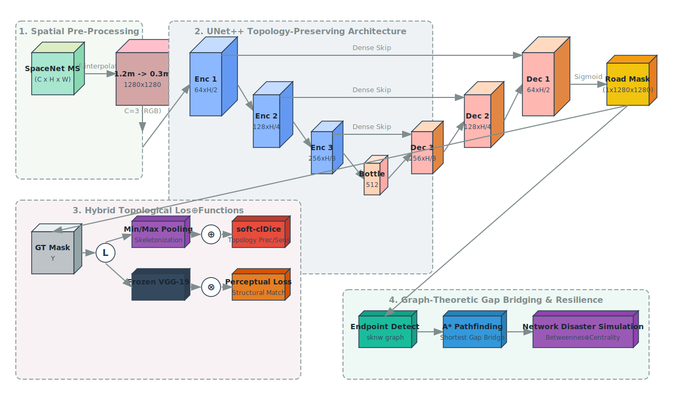
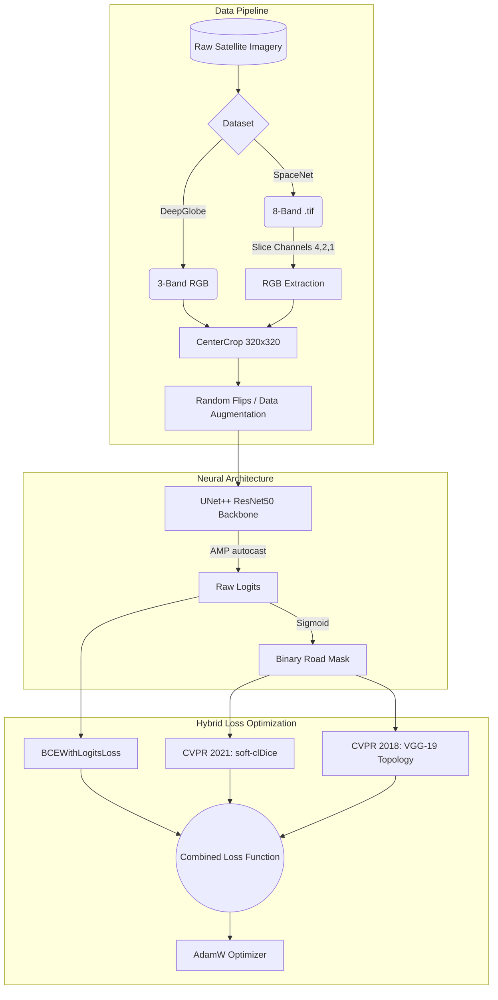
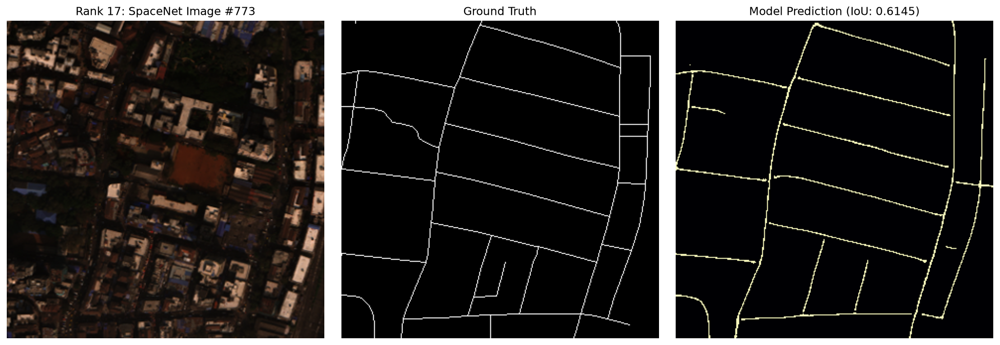
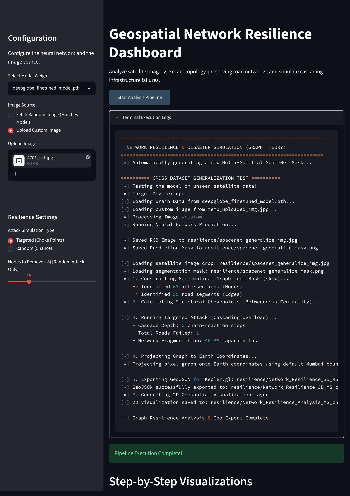
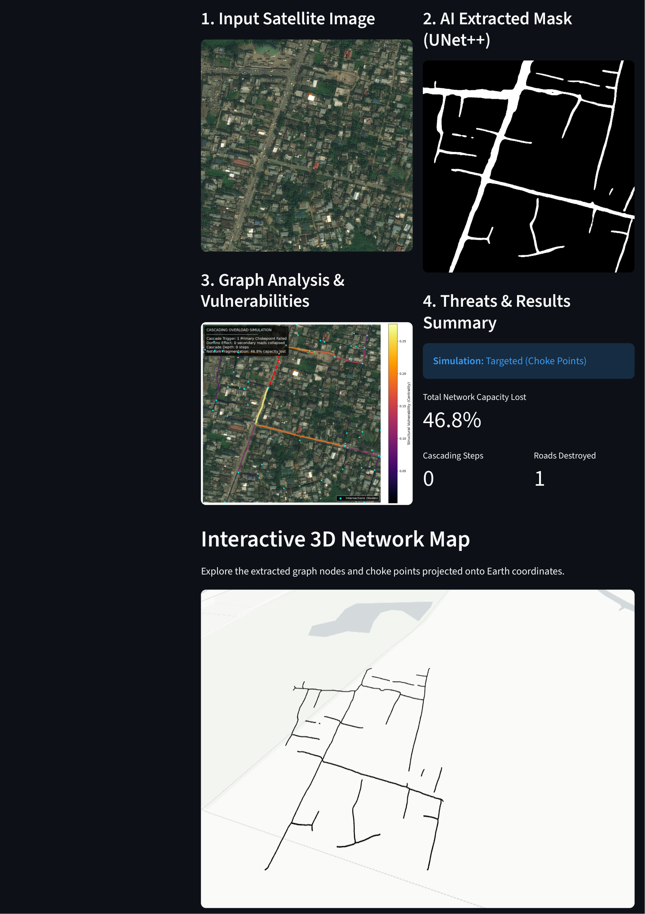

<div align="center">
  
# 🛰️ Bharatiya Antariksh Hackathon 2026

### Route Resilience: Occlusion-Robust Road Extraction & Graph-Theoretic Criticality Analysis for Urban Mobility

[](https://pytorch.org/)
[](https://streamlit.io/)
[](https://networkx.org/)
[](https://opencv.org/)

**Team Name:** Root  
**Team Members:** Swastik Saha (Leader), Tapomoy Sarkar, Arka Prava Das, Soumalya Dey  
**Institution:** Jadavpur University  

</div>

---

## 🚀 The Problem & Our USP

Standard road extraction models use standard pixel-matching algorithms (like BCE or standard Dice). This causes them to output roads that are fragmented and disconnected. If a tree branch covers a road, standard models break the road in half.

**Our Difference:** We implemented **clDice (Centerline-Dice)**, a cutting-edge topological loss function, alongside a massive **VGG Topology Loss**.

### 1. Soft-Skeletonization
Because neural networks require differentiable math, we cannot use standard computer vision skeletonization. Instead, we use "Soft Skeletonization" via morphological operations:
* **Erosion (Min-Pooling):** Shrinks the image using a minimum filter.
* **Dilation (Max-Pooling):** Expands it back out.
* By subtracting the dilated volume from the original volume, we mathematically isolate the absolute center ridge of the road. This iterates 10 times to build the final continuous Skeleton.

Because the neural network is severely penalized if a skeleton fragment is stranded outside a volume, it physically forces the AI to draw continuous, unbroken connections.

### 2. Multi-Modal Judge Architecture
The loss functions are strictly separated from the inference architecture. The **UNet++** acts as the Predictor, while the **Hybrid Loss** acts as a multi-modal Judge during training.

---

## 🏛️ Architecture & Flowchart

<div align="center">
  
</div>



---

## 🏆 Our Accomplishments

### 1. Raw Satellite Data To Road Masks
We successfully trained models on both the SpaceNet 5 (Mumbai) and DeepGlobe datasets. With our combined loss functions, the model performs exceptionally well even on narrow city roads covered with trees and shadows.

<div align="center">
  
</div>

### 2. Mask to Graph Threat Resilience
We take the neural network's raw output mask and "skeletonize" it. We then run a Skeleton-to-Network (sknw) algorithm that converts these pixels into a mathematical Graph. 

We use Network Theory to calculate the Betweenness Centrality of every single intersection to identify critical Choke Points:
1. **Targeted Attacks:** We deliberately delete those high-value Choke Points first, causing a rapid collapse in transit capacity (Simulating Targeted Overload).
2. **Random Attacks:** We delete intersections entirely by chance, simulating natural disasters (Floods, Earthquakes). The network usually survives Random Attacks much longer, degrading slowly rather than collapsing all at once.

<div align="center">
  
</div>

---

## 🗺️ Geospatial Network Resilience Dashboard

We have upgraded the pipeline into a full-scale interactive web application powered by **Streamlit**. 

<div align="center">
  <video src="Documentation/streamlit-app-2026-07-01-13-53-31.webm" width="90%" controls autoplay loop muted></video>
</div>

<div align="center">
  
</div>
<div align="center">
  
</div>

📄 **[View Full High-Resolution Dashboard Report (PDF)](Documentation/AI%20Road%20Topology%20Dashboard3.pdf)**

### Key Features:
1. **Dynamic Model & Data Switching:** Select either the SpaceNet or DeepGlobe weights from a dropdown. The backend will autonomously fetch the correct high-res or low-res imagery to match the domain.
2. **Custom Upload Support:** Safely upload your own arbitrary satellite `.jpg` or `.png`. The engine elegantly pads and resizes the image to 1024x1024 to prevent GPU Out-of-Memory crashes, extracts the roads, and analyzes it.
3. **Disaster Simulation Engine:** Instantly view the Structural Chokepoint Analysis map and read the real-time simulation metrics (Total Capacity Lost, Domino Effect Depth, etc).
4. **PyDeck 3D WebGL Mapping:** Extracts precise GPS coordinates from SpaceNet GeoTIFFs (or applies a hyper-realistic 500m fallback bounding box for arbitrary JPGs) to project the entire road graph onto an interactive 3D map of the Earth.

---

## ⚙️ Quick Start Guide

Follow these steps to boot up the dashboard and run the entire pipeline:

1. **Install Dependencies:**
   ```bash
   pip install -r requirements.txt
   ```

2. **Download the Data Natively (SpaceNet Mumbai):**
   ```bash
   python download_mumbai.py
   ```

3. **Train the Network (Optional):**
   ```bash
   python train.py
   ```

4. **Launch the Streamlit Dashboard:**
   To interact with the neural network live in your browser and run disaster simulations:
   ```bash
   streamlit run app.py
   ```

---

## 📚 Sources & References

**Datasets:**
- DeepGlobe Road Extraction Dataset (Kaggle)
- SpaceNet 5 Mumbai Dataset (AWS)

**Research Papers:**
- *clDice - A Novel Topology-Preserving Loss Function for Tubular Structures* (Shit et al., CVPR 2021)
- *Beyond the Pixel-Wise Loss for Topology-Aware Delineation* (Mosinska et al., CVPR 2018)
- *Multiple centrality assessment in Parma: A network analysis of paths and open spaces* (Sergio Porta, Paolo Crucitti and Vito Latora)
